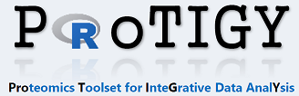

This [Shiny](https://shiny.rstudio.com/) app facilitates exploratory and interactive analysis of quantitative omics datasets. Primarily developed for mass spectrometry-based proteomics data ProTIGY supports any dataset that can be arranged as *p x n* matrix with *p* being features (e.g. proteins, transcripts, genes, ...) quantitativly measured across *n* samples (e.g. replicates of different experimental conditions, ... ). Examples of other datasets other than proteomics include datasets derived from *RNA-seq* or gene expression *microarrays*.

***

## What types of analyses can I do in ProTIGY?

#### Data manipulation
* **Transformation**
    + log transformation
* **Sample-wise Normalization**
    + Centering (median)
    + Centering and scaling (median-MAD)
    + Quantile normalization
    + 2-component normalization
* **Filtering**
    + Reproducibility filter across replicate measurements
    + Standard deviation across samples
    
#### Marker selection (based on _limma_ package)
* One-sample moderated T-test
* Two-sample moderated T-test
* Moderated F-test

#### Interactive data analysis and visualization
* Heatmaps and cluster analysis
* Volcano plots
* Scatterplots
* Principle component analysis
* QC-plots
    + Pairs-plots
    + Correlation matrix
    + Distribution of expression values
    + Missing values

#### Protein-protein interaction (PPI) analysis
* Automatic converison of protein accession numbers ([UniProt](https://www.uniprot.org/), [RefSeq](https://www.ncbi.nlm.nih.gov/refseq/)) to gene symbols
* Integration of protein-protein interaction databases (human only)
    + [InWeb](https://www.ncbi.nlm.nih.gov/pmc/articles/PMC5839635/) 
    + [BioGRID](https://thebiogrid.org/)
    + [Reactome](https://reactome.org/) 

#### Export of analysis results
* Results comprise high-quality figures (pdf), Excel-sheets and the R-workspace itself.
* All results can be downloaded as single zip-file.
* [GCT v1.3](https://clue.io/connectopedia/gct_format)
* [Rmarkdown](https://rmarkdown.rstudio.com/) analysis reports (beta)
* Save and share sessions on a server
    + requires [Shiny Server Pro](https://www.rstudio.com/products/shiny-server-pro/)

***

## How do I get my data into ProTIGY?
ProTIGY takes any type of text file containing both, quantitative and annotation data as input. Result files of proteomics software packages such as [Spectrum Mill](https://www.agilent.com/en/products/software-informatics/masshunter-suite/masshunter-for-life-science-research/spectrum-mill) or [MaxQuant](https://www.biochem.mpg.de/5111795/maxquant) can be readily imported into ProTIGY. 

The preferred data format is [GCT v1.3](https://clue.io/connectopedia/gct_format), a tab-delimited text file format that is convenient for analysis of matrix-compatible datasets as it allows metadata about an experiment to be stored alongside the data from the experiment. 

For file formats other than [GCT v1.3](https://clue.io/connectopedia/gct_format) a separate *experimental design* file annotating which columns in the uploaded data file contain expression data measured across different experimental conditions has to be uploaded separately. This file is dataset specific and a template can be downloaded from ProTIGY. 

More information on how to upload data into ProTIGY can be found in [this pdf file](https://github.com/broadinstitute/protigy/blob/master/docs/2_Protigy_data_formats_and_upload.pdf). 


**Supported file formats:**

  * text files (tsv, csv, txt, ssv)
  * [GCT v1.2](https://software.broadinstitute.org/cancer/software/gsea/wiki/index.php/Data_formats#GCT:_Gene_Cluster_Text_file_format_.28.2A.gct.29)
  * [GCT v1.3](https://clue.io/connectopedia/gct_format)

***

## How can I run ProTIGY on my own hardware?

The app can run locally on your Desktop computer (Windows/Linux/MAC) or can deployed to a [Shiny Server](https://www.rstudio.com/products/shiny/shiny-server/) environment.


#### Running ProTIGY locally

Software requirements:

* [R >3.4](https://cran.r-project.org/)
* [Shiny](https://shiny.rstudio.com/) R-package : ```install.packages("shiny")```
* [Pandoc](https://github.com/jgm/pandoc/releases/tag/2.1.1) (optional, required to create R Markdown reports)
* [Perl](http://strawberryperl.com) (optional, required to create Excel sheets on Windows OS)

The easiest way to play around with ProTIGY is to directly run it from GitHub. Open R and type:

```{r}
shiny::runGitHub("protigy", "broadinstitute")
```

This command will download the repository and run the app. Please follow the instructions to make sure all required R packages will get properly installed. This process might take several minutes when you run the command for the first time. Please note that running ProTIGY from GitHub will reinitaite the download every time which - depending on the available internet connection - might take a moment or two. 

If you plan to use ProTIGY regularily we recommend to clone or download the repository to your local PC/Mac. To start the app open R and type:

```{r}
shiny::runApp("/path/to/Protigy")
```
***

#### Running ProTIGY in a Shiny Server environment

To access all implemented features the app has to be deployed to a [Shiny Server Pro (SSP)](https://www.rstudio.com/products/shiny-server-pro/) instance. SSP specific features include:

* User authentification as provided by SSP.
* Save and retrieve app-sessions on the server.
* Share saved sessions with your team.

Please note that some server specific parameters (e.g. folder to store sessions data, tmp folder, email for trouble shooting, ...) have to be modified accordingly in ```global.R```.  

***

## Where can I find documentation?

Below are slides presented during a BroadE workshop in Feb 2018 at the [Broad Institute](https://www.broadinstitute.org/):

* [1 Introduction into ProTIGY](https://github.com/broadinstitute/protigy/blob/master/docs/1_Introduction_into_Protigy.pdf)
* [2 ProTIGY data formats and upload.pdf](https://github.com/broadinstitute/protigy/blob/master/docs/2_Protigy_data_formats_and_upload.pdf)

***

## License

ProTIGY has been released under [BSD-3](https://github.com/broadinstitute/protigy/blob/master/LICENSE.md) license. ProTIGY is being developed and maintained at the [Proteomics Platform](https://www.broadinstitute.org/proteomics) of the [Broad Institute of MIT and Harvard](https://www.broadinstitute.org/).

***
