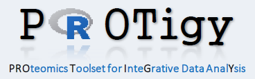

This Shiny app facilitates exploratory and interactive analysis of data sets derived from quantitative  *proteomics* experiments, *RNA-seq* and gene expression *microarrays*.

The app can run locally on your Desktop computer (Windows/Linux/MAC) or can deployed to Shiny Server environments. To access all implemented features the app has to run on a [Shiny Server Pro (SSP)](https://www.rstudio.com/products/shiny-server-pro/) instance, see below for a summary of features only available in SSP. 

#### Supported input formats:
* Any type of text file containing both, expression and annotation columns, can directly be imported into the app.
* Supported file formats:
    + text files (tsv, csv, txt)
    + gct 1.2
    * *NEW* gct 1.3

#### Data manipulation:
* Transformation
    + log transformation
* Sample-wise Normalization
    + Centering (median)
    + Centering and scaling (median-MAD)
    + Quantile
    + 2-component
* Filtering
    + Reproducibility filter across replicate measurements
    + Standard deviation across samples
    
#### Marker selection (based on _limma_ package)
* One-sample moderated T-test
* Two-sample moderated T-test
* Moderated F-test

#### Interactive data analysis and visualization
* Heatmaps and cluster analysis
* Volcano plots
* Scatterplots
* QC-plots
    + Pairs-plots
    + Correlation matrix
    + Distribution of expression values
    + Missing values

#### Proteomics-specific features
* Automatic converison of protein accession numbers (UniProt) to gene symbols
* Integration of protein-protein interaction databases (human only)
    + InWeb 
    + BioGRID
    + Reactome 

#### Export of analysis results
* Results comprise high-quality figures (pdf), Excel-sheets and the R-workspace itself.
* All results can be downloaded as single zip-file. 

#### Shiny Server Pro specific features
* User authentification as provided by SSP.
* Save and retrieve app-sessions on the server.

This app is being developed and maintained at the [Proteomics Platform](https://www.broadinstitute.org/proteomics) of the [Broad Institute of MIT and Harvard](https://www.broadinstitute.org/).

***
